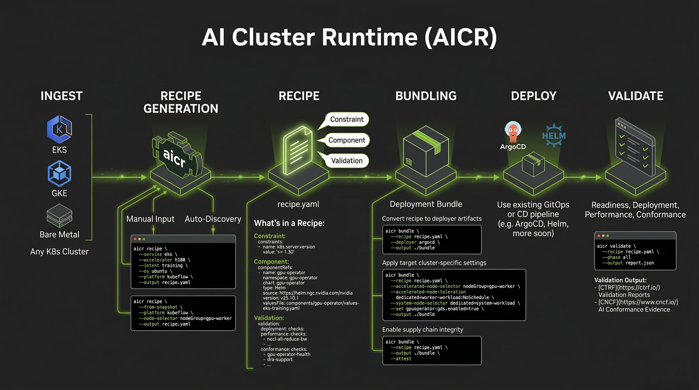

# NVIDIA AI Cluster Runtime

[](https://github.com/NVIDIA/aicr/actions/workflows/on-push.yaml)
[](https://github.com/NVIDIA/aicr/actions/workflows/on-tag.yaml)
[](LICENSE)

AI Cluster Runtime (AICR) makes it easy to stand up GPU-accelerated Kubernetes clusters. It captures known-good combinations of drivers, operators, kernels, and system configurations and publishes them as version-locked **recipes** — reproducible artifacts for Helm, ArgoCD, and other deployment frameworks.

## Why We Built This

Running GPU-accelerated Kubernetes clusters reliably is hard. Small differences in kernel versions, drivers, container runtimes, operators, and Kubernetes releases can cause failures that are difficult to diagnose and expensive to reproduce.

Historically, this knowledge has lived in internal validation pipelines and runbooks. AI Cluster Runtime makes it available to everyone.

Every AICR recipe is:

- **Optimized** — Tuned for a specific combination of hardware, cloud, OS, and workload intent.
- **Validated** — Passes automated constraint and compatibility checks before publishing.
- **Reproducible** — Same inputs produce identical deployments every time.

## Quick Start

Install and generate your first recipe in under two minutes:

```bash
# Install the CLI (Homebrew)
brew tap NVIDIA/aicr
brew install aicr

# Or use the install script
curl -sfL https://raw.githubusercontent.com/NVIDIA/aicr/main/install | bash -s --


# Capture your cluster's current state
aicr snapshot --output snapshot.yaml

# Generate a validated recipe for your environment
aicr recipe --service eks --accelerator h100 --os ubuntu \
  --intent training --platform kubeflow -o recipe.yaml

# Validate the recipe against your cluster
aicr validate --recipe recipe.yaml --snapshot snapshot.yaml

# Render into deployment-ready Helm charts
aicr bundle --recipe recipe.yaml -o ./bundles
```

The `bundles/` directory contains per-component Helm charts with values files, checksums, and deployer configs. Deploy with `helm install`, commit to a GitOps repo, or use the built-in ArgoCD deployer.

See the [Installation Guide](docs/user/installation.md) for manual installation, building from source, and container images.

## Features

| Feature | Description |
|---------|-------------|
| **`aicr` CLI** | Single binary. Generate recipes, create bundles, capture snapshots, validate configs. |
| **API Server (`aicrd`)** | REST API with the same capabilities as the CLI. Run in-cluster for CI/CD integration or air-gapped environments. |
| **Snapshot Agent** | Kubernetes Job that captures live cluster state (GPU hardware, drivers, OS, operators) into a ConfigMap for validation against recipes. |
| **Supply Chain Security** | SLSA Level 3 provenance, signed SBOMs, image attestations (cosign), and checksum verification on every release. |

## Supported Components

| Dimension | This Release |
|-----------|-------------|
| **Kubernetes** | Amazon EKS, GKE, self-managed (Kind) |
| **GPUs** | NVIDIA H100, GB200 |
| **OS** | Ubuntu |
| **Workloads** | Training (Kubeflow), Inference (Dynamo) |
| **Components** | GPU Operator, Network Operator, cert-manager, Prometheus stack, etc. |

See the full [Component Catalog](docs/user/component-catalog.md) for every component that can appear in a recipe. Don't see what you need? [Open an issue](https://github.com/NVIDIA/aicr/issues) — that feedback directly shapes what gets validated next.

## How It Works



A **recipe** is a version-locked configuration for a specific environment. You describe your target (cloud, GPU, OS, workload intent), and the recipe engine matches it against a library of validated **overlays** — layered configurations that compose bottom-up from base defaults through cloud, accelerator, OS, and workload-specific tuning.

The **bundler** materializes a recipe into deployment-ready artifacts: one folder per component, each with Helm values, checksums, and a README. The **validator** compares a recipe against a live cluster snapshot and flags anything out of spec.

This separation means the same validated configuration works whether you deploy with Helm, ArgoCD, Flux, or a custom pipeline.

## What AI Cluster Runtime Is Not

- Not a Kubernetes distribution
- Not a cluster provisioner or lifecycle management system
- Not a managed control plane or hosted service
- Not a replacement for your cloud provider or OEM platform

You bring your cluster and your tools. AI Cluster Runtime tells you what should be installed and how it should be configured.

## Documentation

Choose the path that matches how you'll use the project.

<details>
<summary><strong>User</strong> — Platform and Infrastructure Operators</summary>

- **[Installation Guide](docs/user/installation.md)** — Install the `aicr` CLI (automated script, manual, or build from source)
- **[CLI Reference](docs/user/cli-reference.md)** — Complete command reference with examples
- **[API Reference](docs/user/api-reference.md)** — REST API quick start
- **[Agent Deployment](docs/user/agent-deployment.md)** — Deploy the Kubernetes agent for automated snapshots
- **[Component Catalog](docs/user/component-catalog.md)** — Every component that can appear in a recipe
</details>

<details>
<summary><strong>Contributor</strong> — Developers and Maintainers</summary>

- **[Contributing Guide](CONTRIBUTING.md)** — Development setup, testing, and PR process
- **[Development Guide](DEVELOPMENT.md)** — Local development, Make targets, and tooling
- **[Architecture Overview](docs/contributor/README.md)** — System design and components
- **[Bundler Development](docs/contributor/component.md)** — How to create new bundlers
- **[Data Architecture](docs/contributor/data.md)** — Recipe data model and query matching
- **[Agent Instructions](AGENTS.md)** — Coding-agent guidance for Codex/Copilot
</details>

<details>
<summary><strong>Integrator</strong> — Automation and Platform Engineers</summary>

- **[API Reference](docs/user/api-reference.md)** — REST API endpoints and usage examples
- **[Data Flow](docs/integrator/data-flow.md)** — Understanding snapshots, recipes, and bundles
- **[Automation Guide](docs/integrator/automation.md)** — CI/CD integration patterns
- **[Kubernetes Deployment](docs/integrator/kubernetes-deployment.md)** — Self-hosted API server setup
- **[Recipe Development](docs/integrator/recipe-development.md)** — Adding and modifying recipe metadata
</details>

## Resources

- **[Roadmap](ROADMAP.md)** — Feature priorities and development timeline
- **[Security](SECURITY.md)** — Supply chain security, vulnerability reporting, and verification
- **[Releases](https://github.com/NVIDIA/aicr/releases)** — Binaries, SBOMs, and attestations
- **[Issues](https://github.com/NVIDIA/aicr/issues)** — Bugs, feature requests, and questions

## Contributing

AI Cluster Runtime is Apache 2.0. Contributions are welcome: new recipes for environments we haven't covered (OpenShift, AKS, bare metal), additional bundler formats, validation checks, or bug reports. See [CONTRIBUTING.md](CONTRIBUTING.md) for development setup and the PR process.
