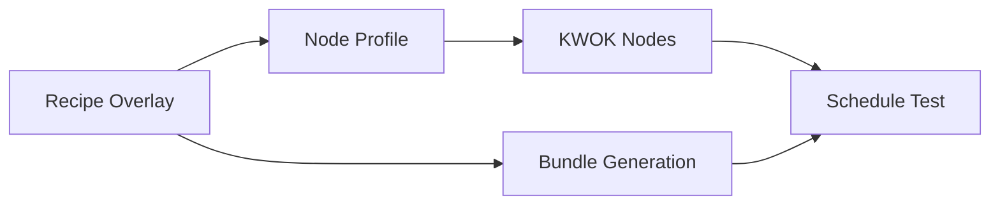

# KWOK-Based Cluster Simulation

KWOK (Kubernetes WithOut Kubelet) tests Eidos bundles against simulated GPU clusters without real hardware.

## Quick Start

```bash
make build                              # Build eidos binary
make kwok-test-all                      # Test all recipes (serial)
make kwok-test-all-parallel             # Test all recipes (parallel, faster)
make kwok-e2e RECIPE=h100-eks-ubuntu-training-kubeflow # Test single recipe
```

## Architecture

Cluster configuration is inferred from recipe overlays - no separate config files needed.



**Components:**

| Component | Location | Purpose |
|-----------|----------|---------|
| Recipe Overlays | `recipes/overlays/*.yaml` | Define cluster criteria (service, accelerator) |
| Node Profiles | `kwok/profiles/{provider}/*.yaml` | Define hardware specs per instance type |
| Scripts | `kwok/scripts/` | Create nodes, validate scheduling |
| CI Workflow | `.github/workflows/kwok-recipes.yaml` | Auto-discover and test recipes |

## How It Works

### Automatic Profile Mapping

The script reads recipe criteria and selects matching profiles:

| Service | Accelerator | GPU Profile |
|---------|-------------|-------------|
| eks | h100 (default) | `eks/p5-h100.yaml` |
| eks | gb200 | `eks/p6-gb200.yaml` |
| gke | any | `eks/p5-h100.yaml` (fallback) |

### Cluster Defaults

- **System nodes**: 2
- **GPU nodes**: 4 (32 GPUs total)
- **Kubernetes**: v1.33.5
- **Region**: us-east-1

## Makefile Targets

| Target | Description |
|--------|-------------|
| `make kwok-test-all` | Test all recipes in shared cluster (serial) |
| `make kwok-test-all-parallel` | Test all recipes in parallel clusters (faster) |
| `make kwok-e2e RECIPE=<name>` | Full e2e: cluster, nodes, validate |
| `make kwok-cluster` | Create Kind cluster with KWOK |
| `make kwok-nodes RECIPE=<name>` | Create simulated nodes |
| `make kwok-test RECIPE=<name>` | Validate scheduling only |
| `make kwok-status` | Show cluster and node status |
| `make kwok-cluster-delete` | Delete cluster |

## Parallel Testing

The `make kwok-test-all-parallel` target runs tests in parallel across multiple Kind clusters:

```bash
# Auto-detect parallelism (CPUs / 2, min 2, max 8)
make kwok-test-all-parallel

# Specify number of parallel clusters
PARALLEL=4 make kwok-test-all-parallel

# Keep clusters after tests for inspection
KEEP_CLUSTERS=true make kwok-test-all-parallel

# Reduce parallelism if cluster creation fails
PARALLEL=2 make kwok-test-all-parallel
```

**How it works:**
1. Processes recipes in batches (batch size = PARALLEL value)
2. For each batch:
   - Creates dedicated Kind clusters (one per recipe)
   - Installs KWOK controller in each cluster
   - Creates recipe-specific KWOK nodes in each cluster
   - Runs tests in parallel (each recipe on its dedicated cluster)
   - Collects results
   - Deletes batch clusters before starting next batch
3. Reports final pass/fail summary

**Benefits:**
- **Faster**: ~3-5x faster than serial testing depending on CPU cores
- **Isolated**: Each recipe runs in its own dedicated cluster with matching hardware
- **Resource-efficient**: Processes in batches to avoid overwhelming the system
- **Correct**: Hardware configuration matches recipe requirements exactly

**Troubleshooting Parallel Tests:**
- If cluster creation fails, logs are preserved in `/tmp/tmp.XXXXXX/`
- Try reducing parallelism: `PARALLEL=2 make kwok-test-all-parallel`
- Clusters are staggered by 2s to reduce resource contention
- KWOK controller timeout is 5 minutes (increased for parallel creation)

## Adding Recipes

A recipe is auto-discovered for KWOK testing if it has `spec.criteria.service` defined.

Create `recipes/overlays/your-recipe.yaml`:

```yaml
kind: recipeMetadata
apiVersion: eidos.nvidia.com/v1alpha1
metadata:
  name: your-recipe-name

spec:
  base: eks-training  # Optional: inherit from existing

  criteria:
    service: eks        # Required for KWOK testing
    accelerator: h100   # Optional: h100, gb200
    intent: training    # Optional

  componentRefs:
    - name: gpu-operator
      type: Helm
      valuesFile: components/gpu-operator/values-eks-training.yaml
```

Test it:

```bash
make build
make kwok-e2e RECIPE=your-recipe-name
```

## Adding Node Profiles

To add a new GPU type, copy an existing profile and modify:

```bash
cp kwok/profiles/eks/p5-h100.yaml kwok/profiles/eks/p5-a100.yaml
# Edit the new file with A100 specs
```

Then update `kwok/scripts/apply-nodes.sh` to map your accelerator to the new profile (see the `get_profiles()` function around line 64).

## Adding Cloud Providers

Copy the `kwok/profiles/eks/` directory structure for your provider and update the mapping in `apply-nodes.sh`. See existing profiles for the expected format.

## CI Integration

The workflow `.github/workflows/kwok-recipes.yaml` calls `run-all-recipes.sh` — the same script used by `make kwok-test-all`. CI uses a single shared Kind cluster and tests recipes sequentially with cleanup between each, ensuring local and CI code paths are identical.

Manual trigger:
```bash
gh workflow run kwok-recipes.yaml -f recipe=your-recipe-name
```

## Troubleshooting

### Pods stuck Pending

Check tolerations match KWOK nodes:
```bash
kubectl describe pod <pod-name> -n eidos-kwok-test
```

GPU pods need tolerations for `kwok.x-k8s.io/node=fake:NoSchedule` and node selector `nvidia.com/gpu.present: "true"`.

### KWOK controller issues

```bash
kubectl logs -n kube-system deployment/kwok-controller
```

### Recipe not being tested

Verify it has `spec.criteria.service` defined (not `any` or `null`):
```bash
yq eval '.spec.criteria.service' recipes/overlays/your-recipe.yaml
```

## Limitations

KWOK validates scheduling, not runtime:

- ✅ Node selectors, tolerations, resource requests
- ✅ Pod scheduling decisions
- ✅ Helm chart generation
- ❌ Container execution
- ❌ GPU functionality
- ❌ Network connectivity

For runtime testing, use Tilt (`make dev-env`) or a real cluster.

## Resources

- [KWOK docs](https://kwok.sigs.k8s.io/)
- [Development guide](../DEVELOPMENT.md)
