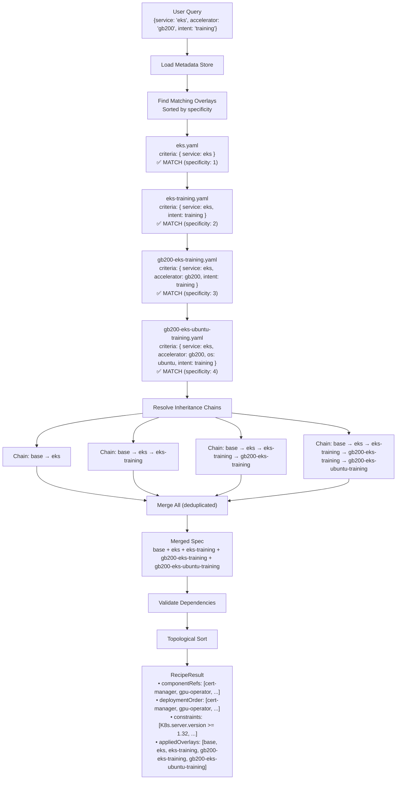
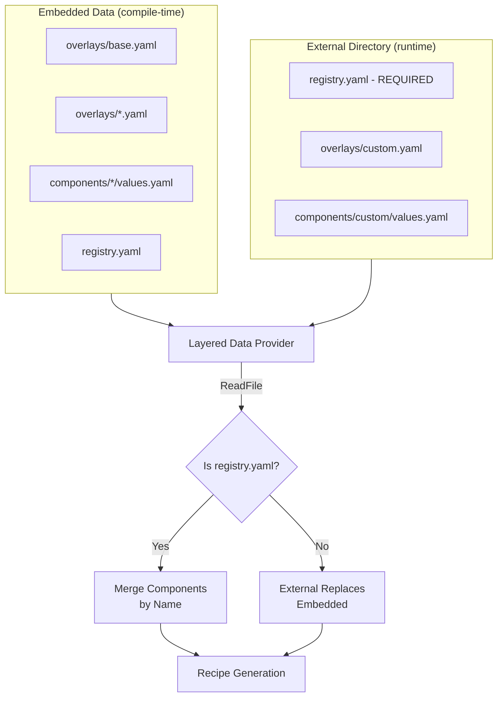

# Data Architecture


This document describes the recipe metadata system used by the CLI and API to generate optimized system configuration recommendations (i.e. recipes) based on environment parameters.

## Table of Contents

- [Overview](#overview)
- [Data Structure](#data-structure)
- [Multi-Level Inheritance](#multi-level-inheritance)
- [Component Configuration](#component-configuration)
- [Criteria Matching Algorithm](#criteria-matching-algorithm)
- [Recipe Generation Process](#recipe-generation-process)
- [Usage Examples](#usage-examples)
- [Maintenance Guide](#maintenance-guide)
- [Automated Validation](#automated-validation)
- [External Data Provider](#external-data-provider)

## Overview

The recipe system is a rule-based configuration engine that generates tailored system configurations by:

1. **Starting with a base recipe** - Universal component definitions and constraints applicable to every recipe
2. **Matching environment-specific overlays** - Targeted configurations based on query criteria (service, accelerator, OS, intent)
3. **Resolving inheritance chains** - Overlays can inherit from intermediate recipes to reduce duplication
4. **Merging configurations** - Components, constraints, and values are merged with overlay precedence
5. **Computing deployment order** - Topological sort of components based on dependency references

The recipe data is organized in [`recipes/`](https://github.com/NVIDIA/aicr/tree/main/recipes/) as multiple YAML files:

```
recipes/
├── registry.yaml                  # Component registry (Helm & Kustomize configs)
├── overlays/                      # Recipe overlays (including base)
│   ├── base.yaml                  # Root recipe - all recipes inherit from this
│   ├── eks.yaml                   # EKS-specific settings
│   ├── eks-training.yaml          # EKS + training workloads (inherits from eks)
│   ├── gb200-eks-ubuntu-training.yaml # GB200/EKS/Ubuntu/training (inherits from eks-training)
│   └── h100-ubuntu-inference.yaml # H100/Ubuntu/inference
└── components/                    # Component values files
    ├── cert-manager/
    │   └── values.yaml
    ├── gpu-operator/
    │   ├── values.yaml            # Base GPU Operator values
    │   └── values-eks-training.yaml # EKS training-optimized values
    ├── network-operator/
    │   └── values.yaml
    ├── nvidia-dra-driver-gpu/
    │   └── values.yaml
    ├── nvsentinel/
    │   └── values.yaml
    └── skyhook-operator/
        └── values.yaml
```

> Note: These files are embedded into both the CLI binary and API server at compile time, making the system fully self-contained with no external dependencies.
>
> **Extensibility**: The embedded data can be extended or overridden using the `--data` flag. See [External Data Provider](#external-data-provider) for details.

**Recipe Usage Patterns:**

1. **CLI Query Mode** - Direct recipe generation from criteria parameters:
   ```bash
   aicr recipe --os ubuntu --accelerator h100 --service eks --intent training
   ```

2. **CLI Snapshot Mode** - Analyze captured system state to infer criteria:
   ```bash
   aicr snapshot --output system.yaml
   aicr recipe --snapshot system.yaml --intent training
   ```

3. **API Server** - HTTP endpoint (query mode only):
   ```bash
   curl "http://localhost:8080/v1/recipe?os=ubuntu&accelerator=h100&service=eks&intent=training"
   ```

## Data Structure

### Recipe Metadata Format

Each recipe file follows this structure:

```yaml
kind: RecipeMetadata
apiVersion: aicr.nvidia.com/v1alpha1
metadata:
  name: <recipe-name>  # Unique identifier (e.g., "eks-training", "gb200-eks-ubuntu-training")

spec:
  base: <parent-recipe>  # Optional - inherits from another recipe
  
  criteria:              # When this recipe/overlay applies
    service: eks         # Kubernetes platform
    accelerator: gb200   # GPU type
    os: ubuntu           # Operating system
    intent: training     # Workload purpose
    platform: kubeflow    # Platform/framework (optional)
  
  constraints:           # Deployment requirements
    - name: K8s.server.version
      value: ">= 1.32"
  
  componentRefs:         # Components to deploy
    - name: gpu-operator
      type: Helm
      source: https://helm.ngc.nvidia.com/nvidia
      version: v25.3.3
      valuesFile: components/gpu-operator/values.yaml
      dependencyRefs:
        - cert-manager
```

### Top-Level Fields

| Field | Description |
|-------|-------------|
| `kind` | Always `recipeMetadata` |
| `apiVersion` | Always `aicr.nvidia.com/v1alpha1` |
| `metadata.name` | Unique recipe identifier |
| `spec.base` | Parent recipe to inherit from (empty = inherits from `overlays/base.yaml`) |
| `spec.criteria` | Query parameters that select this recipe |
| `spec.constraints` | Pre-flight validation rules |
| `spec.componentRefs` | List of components to deploy |

### Criteria Fields

Criteria define when a recipe matches a user query:

| Field | Type | Description | Example Values |
|-------|------|-------------|----------------|
| `service` | String | Kubernetes platform | `eks`, `gke`, `aks`, `oke` |
| `accelerator` | String | GPU hardware type | `h100`, `gb200`, `a100`, `l40` |
| `os` | String | Operating system | `ubuntu`, `rhel`, `cos`, `amazonlinux` |
| `intent` | String | Workload purpose | `training`, `inference` |
| `platform` | String | Platform/framework type | `kubeflow` |
| `nodes` | Integer | Node count (0 = any) | `8`, `16` |

**All fields are optional.** Unpopulated fields act as wildcards (match any value).

### Constraint Format

Constraints use fully qualified measurement paths:

```yaml
constraints:
  - name: K8s.server.version    # {type}.{subtype}.{key}
    value: ">= 1.32"            # Expression or exact value
  
  - name: OS.release.ID
    value: ubuntu               # Exact match
  
  - name: OS.release.VERSION_ID
    value: "24.04"
  
  - name: OS.sysctl./proc/sys/kernel/osrelease
    value: ">= 6.8"
```

**Constraint Path Format:** `{MeasurementType}.{Subtype}.{Key}`

| Measurement Type | Common Subtypes |
|------------------|-----------------|
| `K8s` | `server`, `image`, `config` |
| `OS` | `release`, `sysctl`, `kmod`, `grub` |
| `GPU` | `smi`, `driver`, `device` |
| `SystemD` | `containerd.service`, `kubelet.service` |

**Supported Operators:** `>=`, `<=`, `>`, `<`, `==`, `!=`, or exact match (no operator)

### Component Reference Structure

Each component in `componentRefs` defines a deployable unit. Components can be either Helm or Kustomize based.

**Helm Component Example:**

```yaml
componentRefs:
  - name: gpu-operator           # Component identifier (must match registry name)
    type: Helm                   # Deployment type
    source: https://helm.ngc.nvidia.com/nvidia  # Helm repository URL
    version: v25.3.3             # Chart version
    valuesFile: components/gpu-operator/values.yaml  # Path to values file
    overrides:                   # Inline value overrides
      driver:
        version: 580.82.07
      cdi:
        enabled: true
    dependencyRefs:              # Components this depends on
      - cert-manager
```

**Kustomize Component Example:**

```yaml
componentRefs:
  - name: my-kustomize-app       # Component identifier (must match registry name)
    type: Kustomize              # Deployment type
    source: https://github.com/example/my-app  # Git repository or OCI reference
    tag: v1.0.0                  # Git tag, branch, or commit
    path: deploy/production      # Path to kustomization within repo
    patches:                     # Patch files to apply
      - patches/custom-patch.yaml
    dependencyRefs:
      - cert-manager
```

**Component Fields:**

| Field | Required | Description |
|-------|----------|-------------|
| `name` | Yes | Unique component identifier (matches registry name) |
| `type` | Yes | `Helm` or `Kustomize` |
| `source` | Yes | Repository URL, OCI reference, or Git URL |
| `version` | No | Chart version (for Helm) |
| `tag` | No | Git tag, branch, or commit (for Kustomize) |
| `path` | No | Path to kustomization within repository (for Kustomize) |
| `valuesFile` | No | Path to values file (relative to data directory, for Helm) |
| `overrides` | No | Inline values that override valuesFile (for Helm) |
| `patches` | No | Patch files to apply (for Kustomize) |
| `dependencyRefs` | No | List of component names this depends on |

## Multi-Level Inheritance

Recipe files support **multi-level inheritance** through the `spec.base` field. This enables building inheritance chains where intermediate recipes capture shared configurations, reducing duplication and improving maintainability.

### Inheritance Mechanism

Each recipe can specify a parent recipe via `spec.base`:

```yaml
kind: RecipeMetadata
apiVersion: aicr.nvidia.com/v1alpha1
metadata:
  name: gb200-eks-ubuntu-training

spec:
  base: eks-training  # Inherits from eks-training recipe
  
  criteria:
    service: eks
    accelerator: gb200
    os: ubuntu
    intent: training
    
  # Only GB200-specific overrides here
  componentRefs:
    - name: gpu-operator
      version: v25.3.3
      overrides:
        driver:
          version: 580.82.07
```

### Inheritance Chain Example

The system supports inheritance chains of arbitrary depth:

```
overlays/base.yaml
    │
    ├── overlays/eks.yaml (spec.base: empty → inherits from base)
    │       │
    │       └── overlays/eks-training.yaml (spec.base: eks)
    │               │
    │               └── overlays/gb200-eks-training.yaml (spec.base: eks-training)
    │                       │
    │                       └── overlays/gb200-eks-ubuntu-training.yaml (spec.base: gb200-eks-training)
    │
    └── overlays/h100-ubuntu-inference.yaml (spec.base: empty → inherits from base)
```

**Resolution Order:** When resolving `gb200-eks-ubuntu-training`:
1. Start with `overlays/base.yaml` (root)
2. Merge `overlays/eks.yaml` (EKS-specific settings)
3. Merge `overlays/eks-training.yaml` (training optimizations)
4. Merge `overlays/gb200-eks-training.yaml` (GB200 + training-specific overrides)
5. Merge `overlays/gb200-eks-ubuntu-training.yaml` (Ubuntu + full-spec overrides)

### Inheritance Rules

**1. Base Resolution**
- `spec.base: ""` or omitted → Inherits directly from `overlays/base.yaml`
- `spec.base: "eks"` → Inherits from the recipe named "eks"
- The root `overlays/base.yaml` has no parent (it's the foundation)

**2. Merge Precedence**
Later recipes in the chain override earlier ones:
```
base → eks → eks-training → gb200-eks-training → gb200-eks-ubuntu-training
(lowest)                                            (highest priority)
```

**3. Field Merging**
- **Constraints**: Same-named constraints are overridden; new constraints are added
- **ComponentRefs**: Same-named components are merged field-by-field; new components are added
- **Criteria**: Each recipe defines its own criteria (not inherited)

### Intermediate vs Leaf Recipes

**Intermediate Recipes** (e.g., `eks.yaml`, `eks-training.yaml`):
- Have **partial criteria** (not all fields specified)
- Capture shared configurations for a category
- Can be matched by user queries (but typically less specific)

**Leaf Recipes** (e.g., `gb200-eks-ubuntu-training.yaml`):
- Have **complete criteria** (all required fields)
- Matched by specific user queries
- Contain final, hardware-specific overrides

### Example: Inheritance Chain

```yaml
# overlays/base.yaml - Foundation for all recipes
kind: RecipeMetadata
apiVersion: aicr.nvidia.com/v1alpha1
metadata:
  name: base

spec:
  constraints:
    - name: K8s.server.version
      value: ">= 1.25"

  componentRefs:
    - name: cert-manager
      type: Helm
      source: https://charts.jetstack.io
      version: v1.17.2
      valuesFile: components/cert-manager/values.yaml

    - name: gpu-operator
      type: Helm
      source: https://helm.ngc.nvidia.com/nvidia
      version: v25.10.1
      valuesFile: components/gpu-operator/values.yaml
      dependencyRefs:
        - cert-manager
```

```yaml
# eks.yaml - EKS-specific settings
kind: RecipeMetadata
apiVersion: aicr.nvidia.com/v1alpha1
metadata:
  name: eks

spec:
  # Implicit base (inherits from overlays/base.yaml)
  
  criteria:
    service: eks  # Only service specified (partial criteria)

  constraints:
    - name: K8s.server.version
      value: ">= 1.28"  # EKS minimum version
```

```yaml
# eks-training.yaml - EKS training workloads
kind: RecipeMetadata
apiVersion: aicr.nvidia.com/v1alpha1
metadata:
  name: eks-training

spec:
  base: eks  # Inherits EKS settings
  
  criteria:
    service: eks
    intent: training  # Added training intent (still partial)

  constraints:
    - name: K8s.server.version
      value: ">= 1.30"  # Training requires newer K8s

  componentRefs:
    # Training workloads use training-optimized values
    - name: gpu-operator
      valuesFile: components/gpu-operator/values-eks-training.yaml
```

### Benefits of Multi-Level Inheritance

| Benefit | Description |
|---------|-------------|
| **Reduced Duplication** | Shared settings defined once in intermediate recipes |
| **Easier Maintenance** | Update EKS settings in one place, all EKS recipes inherit |
| **Clear Organization** | Hierarchy reflects logical relationships |
| **Flexible Extension** | Add new leaf recipes without duplicating parent configs |
| **Testable** | Each level can be validated independently |

### Cycle Detection

The system detects circular inheritance to prevent infinite loops:

```yaml
# INVALID: Would create cycle
# a.yaml: spec.base: b
# b.yaml: spec.base: c
# c.yaml: spec.base: a  ← Cycle detected!
```

Tests in `pkg/recipe/yaml_test.go` automatically validate:
- All `spec.base` references point to existing recipes
- No circular inheritance chains exist
- Inheritance depth is reasonable (max 10 levels)

## Component Configuration

Components are configured through a three-tier system with clear precedence.

### Configuration Patterns

**Pattern 1: ValuesFile Only**
Traditional approach - all values in a separate file:
```yaml
componentRefs:
  - name: gpu-operator
    valuesFile: components/gpu-operator/values.yaml
```

**Pattern 2: Overrides Only**
Fully self-contained recipe with inline values:
```yaml
componentRefs:
  - name: gpu-operator
    overrides:
      driver:
        version: 580.82.07
      cdi:
        enabled: true
```

**Pattern 3: ValuesFile + Overrides (Hybrid)**
Reusable base with recipe-specific tweaks:
```yaml
componentRefs:
  - name: gpu-operator
    valuesFile: components/gpu-operator/values.yaml  # Base configuration
    overrides:                                        # Recipe-specific tweaks
      driver:
        version: 580.82.07
```

### Value Merge Precedence

When values are resolved, merge order is:

```
Base ValuesFile → Overlay ValuesFile → Overlay Overrides → CLI --set flags
     (lowest)                                                   (highest)
```

1. **Base ValuesFile**: Values from inherited recipes
2. **Overlay ValuesFile**: Values file specified in the matching overlay
3. **Overlay Overrides**: Inline `overrides` in the overlay's componentRef
4. **CLI --set flags**: Runtime overrides from `aicr bundle --set`

### Component Values Files

Values files are stored in `recipes/components/{component}/`:

```yaml
# components/gpu-operator/values.yaml
operator:
  upgradeCRD: true
  resources:
    limits:
      cpu: 500m
      memory: 700Mi

driver:
  version: 580.105.08
  enabled: true
  useOpenKernelModules: true
  rdma:
    enabled: true

devicePlugin:
  enabled: true
```

### Dependency Management

Components can declare dependencies via `dependencyRefs`:

```yaml
componentRefs:
  - name: cert-manager
    type: Helm
    version: v1.17.2

  - name: gpu-operator
    type: Helm
    version: v25.10.1
    dependencyRefs:
      - cert-manager  # Deploy cert-manager first
```

The system performs **topological sort** to compute deployment order, ensuring dependencies are deployed before dependents. The resulting order is exposed in `RecipeResult.DeploymentOrder`.

## Criteria Matching Algorithm

The recipe system uses an **asymmetric rule matching algorithm** where recipe criteria (rules) match against user queries (candidates).

### Matching Rules

A recipe's criteria matches a user query when **every non-"any" field in the criteria is satisfied by the query**:

1. **Empty/unpopulated fields in recipe criteria** = Wildcard (matches any query value)
2. **Populated fields must match exactly** (case-insensitive)
3. **Matching is asymmetric**: A recipe with specific fields (e.g., `accelerator: h100`) will NOT match a generic query (e.g., `accelerator: any`)

### Asymmetric Matching Explained

The key insight is that matching is **one-directional**:

- **Recipe "any"** (or empty) → Matches ANY query value (acts as wildcard)
- **Query "any"** → Only matches recipe "any" (does NOT match specific recipes)

This prevents overly specific recipes from being selected when the user hasn't specified those criteria.

### Matching Logic

```go
// Asymmetric matching: recipe criteria as receiver, query as parameter
func (c *Criteria) Matches(other *Criteria) bool {
    // If recipe (c) is "any" (or empty), it matches any query value (wildcard).
    // If query (other) is "any" but recipe is specific, it does NOT match.
    // If both have specific values, they must match exactly.
    
    // For each field, call matchesCriteriaField(recipeValue, queryValue)
    // ...
    return true
}

// matchesCriteriaField implements asymmetric matching for a single field.
func matchesCriteriaField(recipeValue, queryValue string) bool {
    recipeIsAny := recipeValue == "any" || recipeValue == ""
    queryIsAny := queryValue == "any" || queryValue == ""

    // If recipe is "any", it matches any query value (recipe is generic)
    if recipeIsAny {
        return true
    }

    // Recipe has a specific value
    // Query must also have that specific value (not "any")
    if queryIsAny {
        // Query is generic but recipe is specific - no match
        return false
    }

    // Both have specific values - must match exactly
    return recipeValue == queryValue
}
```

### Specificity Scoring

When multiple recipes match, they are sorted by **specificity** (number of non-"any" fields). More specific recipes are applied later, giving them higher precedence:

```go
func (c *Criteria) Specificity() int {
    score := 0
    if c.Service != "any" { score++ }
    if c.Accelerator != "any" { score++ }
    if c.Intent != "any" { score++ }
    if c.OS != "any" { score++ }
    if c.Nodes != 0 { score++ }
    return score
}
```

### Matching Examples

**Example 1: Broad Recipe Matches Specific Query**
```yaml
Recipe Criteria: { service: "eks" }
User Query:      { service: "eks", os: "ubuntu", accelerator: "h100" }
Result:          ✅ MATCH - Recipe only requires service=eks, other fields are wildcards
Specificity:     1
```

**Example 2: Specific Recipe Doesn't Match Different Specific Query**
```yaml
Recipe Criteria: { service: "eks", accelerator: "gb200", intent: "training" }
User Query:      { service: "eks", os: "ubuntu", accelerator: "h100" }
Result:          ❌ NO MATCH - Accelerator doesn't match (gb200 ≠ h100)
```

**Example 3: Specific Recipe Doesn't Match Generic Query (Asymmetric)**
```yaml
Recipe Criteria: { service: "eks", accelerator: "gb200", intent: "training" }
User Query:      { service: "eks", intent: "training" }  # accelerator unspecified = "any"
Result:          ❌ NO MATCH - Recipe requires gb200, query has "any" (wildcard doesn't match specific)
```

This asymmetric behavior ensures that a generic query like `--service eks --intent training` only matches generic recipes, not hardware-specific ones like `gb200-eks-training.yaml`.

**Example 4: Multiple Matches (Fully Specific Query)**
```yaml
User Query: { service: "eks", os: "ubuntu", accelerator: "gb200", intent: "training" }

Matching Recipes (sorted by specificity):
  1. overlays/base.yaml              { }  (all "any")                                    Specificity: 0
  2. overlays/eks.yaml               { service: eks }                                    Specificity: 1
  3. overlays/eks-training.yaml      { service: eks, intent: training }                  Specificity: 2
  4. overlays/gb200-eks-training.yaml { service: eks, accelerator: gb200, intent: training }  Specificity: 3
  5. overlays/gb200-eks-ubuntu-training.yaml { service: eks, accelerator: gb200, os: ubuntu, intent: training }  Specificity: 4

Result: All matching recipes are applied in order of specificity
```

## Recipe Generation Process

The recipe builder (`pkg/recipe/metadata_store.go`) generates recipes through the following steps:

### Step 1: Load Metadata Store

```go
store, err := loadMetadataStore(ctx)
```

- Embedded YAML files are parsed into Go structs
- Cached in memory on first access (singleton pattern with `sync.Once`)
- Contains base recipe, all overlays, and component values files

### Step 2: Find Matching Overlays

```go
overlays := store.FindMatchingOverlays(criteria)
```

- Iterate all overlay recipes
- Check if each overlay's criteria matches the user query
- Sort matches by specificity (least specific first)

### Step 3: Resolve Inheritance Chains

For each matching overlay:

```go
chain, err := store.resolveInheritanceChain(overlay.Metadata.Name)
```

- Build the chain from root (base) to the target overlay
- Detect cycles to prevent infinite loops
- Example: `["base", "eks", "eks-training", "gb200-eks-ubuntu-training"]`

### Step 4: Merge Specifications

```go
for _, recipe := range chain {
    mergedSpec.Merge(&recipe.Spec)
}
```

**Merge Algorithm:**
- **Constraints**: Same-named constraints are overridden; new constraints are added
- **ComponentRefs**: Same-named components are merged field-by-field using `mergeComponentRef()`

```go
func mergeComponentRef(base, overlay ComponentRef) ComponentRef {
    result := base
    if overlay.Type != "" { result.Type = overlay.Type }
    if overlay.Source != "" { result.Source = overlay.Source }
    if overlay.Version != "" { result.Version = overlay.Version }
    if overlay.ValuesFile != "" { result.ValuesFile = overlay.ValuesFile }
    // Merge overrides maps
    if overlay.Overrides != nil {
        result.Overrides = deepMerge(base.Overrides, overlay.Overrides)
    }
    // Merge dependency refs
    if len(overlay.DependencyRefs) > 0 {
        result.DependencyRefs = mergeDependencyRefs(base.DependencyRefs, overlay.DependencyRefs)
    }
    return result
}
```

### Step 5: Validate Dependencies

```go
if err := mergedSpec.ValidateDependencies(); err != nil {
    return nil, err
}
```

- Verify all `dependencyRefs` reference existing components
- Detect circular dependencies

### Step 6: Compute Deployment Order

```go
deployOrder, err := mergedSpec.TopologicalSort()
```

- Topologically sort components based on `dependencyRefs`
- Ensures dependencies are deployed before dependents

### Step 7: Build RecipeResult

```go
return &RecipeResult{
    Kind:            "RecipeResult",
    APIVersion:      "aicr.nvidia.com/v1alpha1",
    Metadata:        metadata,
    Criteria:        criteria,
    Constraints:     mergedSpec.Constraints,
    ComponentRefs:   mergedSpec.ComponentRefs,
    DeploymentOrder: deployOrder,
}, nil
```

### Complete Flow Diagram



## Usage Examples

### CLI Usage

**Basic recipe generation (query mode):**
```bash
aicr recipe --os ubuntu --service eks --accelerator h100 --intent training
```

**Full specification:**
```bash
aicr recipe \
  --os ubuntu \
  --service eks \
  --accelerator gb200 \
  --intent training \
  --nodes 8 \
  --format yaml \
  --output recipe.yaml
```

**From snapshot (snapshot mode):**
```bash
aicr snapshot --output snapshot.yaml
aicr recipe --snapshot snapshot.yaml --intent training --output recipe.yaml
```

### API Usage

**Basic query:**
```bash
curl "http://localhost:8080/v1/recipe?os=ubuntu&service=eks&accelerator=h100"
```

**Full specification:**
```bash
curl "http://localhost:8080/v1/recipe?os=ubuntu&service=eks&accelerator=gb200&intent=training&nodes=8"
```

### Example Response (RecipeResult)

```json
{
  "kind": "RecipeResult",
  "apiVersion": "aicr.nvidia.com/v1alpha1",
  "metadata": {
    "version": "v0.8.0",
    "appliedOverlays": [
      "base",
      "eks",
      "eks-training",
      "gb200-eks-ubuntu-training"
    ]
  },
  "criteria": {
    "service": "eks",
    "accelerator": "gb200",
    "os": "ubuntu",
    "intent": "training"
  },
  "constraints": [
    {
      "name": "K8s.server.version",
      "value": ">= 1.32.4"
    },
    {
      "name": "OS.release.ID",
      "value": "ubuntu"
    },
    {
      "name": "OS.release.VERSION_ID",
      "value": "24.04"
    }
  ],
  "componentRefs": [
    {
      "name": "cert-manager",
      "type": "Helm",
      "source": "https://charts.jetstack.io",
      "version": "v1.17.2",
      "valuesFile": "components/cert-manager/values.yaml"
    },
    {
      "name": "gpu-operator",
      "type": "Helm",
      "source": "https://helm.ngc.nvidia.com/nvidia",
      "version": "v25.3.3",
      "valuesFile": "components/gpu-operator/values-eks-training.yaml",
      "overrides": {
        "driver": {
          "version": "580.82.07"
        },
        "cdi": {
          "enabled": true
        }
      },
      "dependencyRefs": ["cert-manager"]
    },
    {
      "name": "nvsentinel",
      "type": "Helm",
      "source": "oci://ghcr.io/nvidia/nvsentinel",
      "version": "v0.6.0",
      "valuesFile": "components/nvsentinel/values.yaml",
      "dependencyRefs": ["cert-manager"]
    },
    {
      "name": "skyhook-operator",
      "type": "Helm",
      "source": "oci://ghcr.io/nvidia/skyhook",
      "version": "v0.4.0",
      "valuesFile": "components/skyhook-operator/values.yaml",
      "overrides": {
        "customization": "ubuntu"
      }
    }
  ],
  "deploymentOrder": [
    "cert-manager",
    "gpu-operator",
    "nvsentinel",
    "skyhook-operator"
  ]
}
```

## Maintenance Guide

### Adding a New Recipe

1. **Create the recipe file** in `recipes/`:
   ```yaml
   kind: RecipeMetadata
   apiVersion: aicr.nvidia.com/v1alpha1
   metadata:
     name: l40-gke-ubuntu-inference  # Unique name
   
   spec:
     base: gke-inference  # Inherit from appropriate parent
     
     criteria:
       service: gke
       accelerator: l40
       os: ubuntu
       intent: inference
     
     constraints:
       - name: K8s.server.version
         value: ">= 1.29"
     
     componentRefs:
       - name: gpu-operator
         version: v25.3.3
         overrides:
           driver:
             version: 560.35.03
   ```

2. **Create intermediate recipes** if needed (e.g., `gke.yaml`, `gke-inference.yaml`)

3. **Add component values files** if using new configurations:
   ```yaml
   # components/gpu-operator/values-gke-inference.yaml
   driver:
     enabled: true
     version: 560.35.03
   ```

4. **Run tests** to validate:
   ```bash
   go test -v ./pkg/recipe/... -run TestAllMetadataFilesParseCorrectly
   ```

### Modifying Existing Recipes

1. **Update constraints** - Change version requirements:
   ```yaml
   constraints:
     - name: K8s.server.version
       value: ">= 1.33"  # Updated from 1.32
   ```

2. **Update component versions** - Bump chart versions:
   ```yaml
   componentRefs:
     - name: gpu-operator
       version: v25.4.0  # Updated from v25.3.3
   ```

3. **Add inline overrides** - Recipe-specific tweaks:
   ```yaml
   componentRefs:
     - name: gpu-operator
       overrides:
         newFeature:
           enabled: true
   ```

### Updating Component Values

1. **Modify values file** in `recipes/components/{component}/values.yaml`

2. **Create variant values file** for specific environments:
   - `values.yaml` - Base configuration
   - `values-eks-training.yaml` - EKS training optimization
   - `values-gke-inference.yaml` - GKE inference optimization

3. **Reference in recipe**:
   ```yaml
   componentRefs:
     - name: gpu-operator
       valuesFile: components/gpu-operator/values-gke-inference.yaml
   ```

---

## Automated Validation

The recipe data system includes comprehensive automated tests to ensure data integrity. These tests run automatically as part of `make test` and validate all recipe metadata files and component values.

### Test Suite Overview

The test suite is organized in `pkg/recipe/`:

| File | Responsibility |
|------|----------------|
| `yaml_test.go` | Static YAML file validation (parsing, references, enums, inheritance) |
| `metadata_test.go` | Runtime behavior tests (Merge, TopologicalSort, inheritance resolution) |
| `recipe_test.go` | Recipe struct validation (Validate, ValidateStructure) |

### Test Categories

| Test Category | What It Validates |
|---------------|-------------------|
| Schema Conformance | All YAML files parse correctly with expected structure |
| Criteria Validation | Valid enum values for service, accelerator, intent, OS |
| Reference Validation | valuesFile paths exist, dependencyRefs resolve, component names valid |
| Constraint Syntax | Measurement paths use valid types, operators are valid |
| Dependency Cycles | No circular dependencies in componentRefs |
| Inheritance Chains | Base references valid, no circular inheritance, reasonable depth |
| Values Files | Component values files parse as valid YAML |

### Inheritance-Specific Tests

| Test | What It Validates |
|------|-------------------|
| `TestAllBaseReferencesPointToExistingRecipes` | All `spec.base` references resolve to existing recipes |
| `TestNoCircularBaseReferences` | No circular inheritance chains (a→b→c→a) |
| `TestInheritanceChainDepthReasonable` | Inheritance depth ≤ 10 levels |

### Running Tests

```bash
# Run all recipe data tests
make test

# Run only recipe package tests
go test -v ./pkg/recipe/... -count=1

# Run specific test patterns
go test -v ./pkg/recipe/... -run TestAllMetadataFilesParseCorrectly
go test -v ./pkg/recipe/... -run TestAllBaseReferencesPointToExistingRecipes
go test -v ./pkg/recipe/... -run TestAllOverlayCriteriaUseValidEnums
```

### CI/CD Integration

Tests run automatically on:
- **Pull Requests**: All tests must pass before merge
- **Push to main**: Validates no regressions
- **Release builds**: Ensures data integrity in released binaries

```yaml
# GitHub Actions workflow snippet
jobs:
  validate:
    runs-on: ubuntu-latest
    steps:
      - uses: actions/checkout@v5
      - uses: ./.github/actions/go-ci
        with:
          go_version: '1.25'
          golangci_lint_version: 'v2.6'
```

### Adding New Tests

When adding new recipe metadata or component configurations:

1. **Create the new file** in `recipes/`
2. **Run tests** to verify the file is valid:
   ```bash
   go test -v ./pkg/recipe/... -run TestAllMetadataFilesParseCorrectly
   ```
3. **Check for conflicts** with existing recipes:
   ```bash
   go test -v ./pkg/recipe/... -run TestNoDuplicateCriteria
   ```
4. **Verify references** if using valuesFile or dependencyRefs:
   ```bash
   go test -v ./pkg/recipe/... -run TestValuesFileReferencesExist
   go test -v ./pkg/recipe/... -run TestDependencyRefsResolve
   ```

---

## External Data Provider

The recipe system supports extending or overriding embedded data with external files via the `--data` CLI flag. This enables customization without rebuilding the CLI binary.

### Architecture Overview



### Data Provider Interface

The system uses a `DataProvider` interface to abstract file access:

```go
type DataProvider interface {
    // ReadFile reads a file by path (relative to data directory)
    ReadFile(path string) ([]byte, error)

    // WalkDir walks the directory tree rooted at root
    WalkDir(root string, fn fs.WalkDirFunc) error

    // Source returns where data came from (for debugging)
    Source(path string) string
}
```

**Provider Types:**
- `EmbeddedDataProvider`: Wraps Go's `embed.FS` for compile-time embedded data
- `LayeredDataProvider`: Overlays external directory on top of embedded data

### Merge Behavior

| File Type | Behavior | Example |
|-----------|----------|---------|
| `registry.yaml` | **Merged** by component name | External adds/replaces components |
| `overlays/base.yaml` | **Replaced** if exists externally | External completely overrides embedded |
| `overlays/*.yaml` | **Replaced** if same path | External overlay replaces embedded |
| `components/*/values.yaml` | **Replaced** if same path | External values override embedded |

### Registry Merge Algorithm

When merging `registry.yaml`, components are matched by their `name` field:

```go
func mergeRegistries(embedded, external *ComponentRegistry) *ComponentRegistry {
    // 1. Index external components by name
    externalByName := make(map[string]*ComponentConfig)
    for _, comp := range external.Components {
        externalByName[comp.Name] = comp
    }

    // 2. Add embedded components, replacing with external if present
    for _, comp := range embedded.Components {
        if ext, found := externalByName[comp.Name]; found {
            result.Components = append(result.Components, *ext)  // External wins
        } else {
            result.Components = append(result.Components, comp)  // Keep embedded
        }
    }

    // 3. Add new components from external (not in embedded)
    for _, comp := range external.Components {
        if !addedNames[comp.Name] {
            result.Components = append(result.Components, comp)
        }
    }

    return result
}
```

**Merge Order:**
1. Start with all embedded components
2. Replace any that have same name in external
3. Add any new components from external

### Security Validations

The `LayeredDataProvider` enforces security constraints:

| Validation | Behavior |
|------------|----------|
| **Directory exists** | External directory must exist and be a directory |
| **registry.yaml required** | External directory must contain `registry.yaml` |
| **No path traversal** | Paths containing `..` are rejected |
| **No symlinks** | Symlinks are rejected by default (`AllowSymlinks: false`) |
| **File size limit** | Files exceeding 10MB are rejected (configurable) |

### Configuration Options

```go
type LayeredProviderConfig struct {
    // ExternalDir is the path to the external data directory
    ExternalDir string

    // MaxFileSize is the maximum allowed file size in bytes (default: 10MB)
    MaxFileSize int64

    // AllowSymlinks allows symlinks in the external directory (default: false)
    AllowSymlinks bool
}
```

### Usage Example

**Creating an external data directory:**

```
my-data/
├── registry.yaml              # Required - merged with embedded
├── overlays/
│   └── my-custom-overlay.yaml # Adds new overlay
└── components/
    └── gpu-operator/
        └── values.yaml        # Replaces embedded gpu-operator values
```

**External registry.yaml (adds custom Helm component):**

```yaml
apiVersion: aicr.nvidia.com/v1alpha1
kind: ComponentRegistry
components:
  - name: my-custom-operator
    displayName: My Custom Operator
    helm:
      defaultRepository: https://my-charts.example.com
      defaultChart: my-custom-operator
      defaultVersion: v1.0.0
```

**External registry.yaml (adds custom Kustomize component):**

```yaml
apiVersion: aicr.nvidia.com/v1alpha1
kind: ComponentRegistry
components:
  - name: my-kustomize-app
    displayName: My Kustomize App
    valueOverrideKeys:
      - mykustomize
    kustomize:
      defaultSource: https://github.com/example/my-app
      defaultPath: deploy/production
      defaultTag: v1.0.0
```

**Note:** A component must have either `helm` OR `kustomize` configuration, not both.

**CLI usage:**

```bash
# Generate recipe with external data
aicr recipe --service eks --accelerator h100 --data ./my-data

# Bundle with external data
aicr bundle --recipe recipe.yaml --data ./my-data --output ./bundles
```

### Debugging

Use `--debug` flag to see detailed logging about external data loading:

```bash
aicr --debug recipe --service eks --data ./my-data
```

Debug logs include:
- Files discovered in external directory
- Source resolution for each file (embedded vs external vs merged)
- Component merge details (added, overridden, retained)

### Implementation Details

The data provider is initialized early in CLI command execution:

```go
// pkg/cli/root.go
func initDataProvider(cmd *cli.Command) error {
    dataDir := cmd.String("data")
    if dataDir == "" {
        return nil  // Use default embedded provider
    }

    embedded := recipe.NewEmbeddedDataProvider(recipe.GetEmbeddedFS(), "data")
    layered, err := recipe.NewLayeredDataProvider(embedded, recipe.LayeredProviderConfig{
        ExternalDir:   dataDir,
        AllowSymlinks: false,
    })
    if err != nil {
        return err
    }

    recipe.SetDataProvider(layered)
    return nil
}
```

**Global Provider Pattern:**
- `SetDataProvider()` sets the global data provider
- `GetDataProvider()` returns the current provider (defaults to embedded)
- `GetDataProviderGeneration()` returns a counter for cache invalidation

---

## See Also

- [Recipe Development Guide](/docs/integrator/recipe-development) - Adding and modifying recipe data
- [CLI Architecture](/docs/contributor/cli) - How the CLI uses recipe data
- [CLI Reference](/docs/user/cli-reference) - Complete CLI flag reference
- [API Server Architecture](/docs/contributor/api-server) - How the API serves recipes
- [OpenAPI Specification](https://github.com/NVIDIA/aicr/tree/main/api/aicr/v1/server.yaml) - Recipe API contract
- [Recipe Package Documentation](https://github.com/NVIDIA/aicr/tree/main/pkg/recipe/) - Go implementation details
